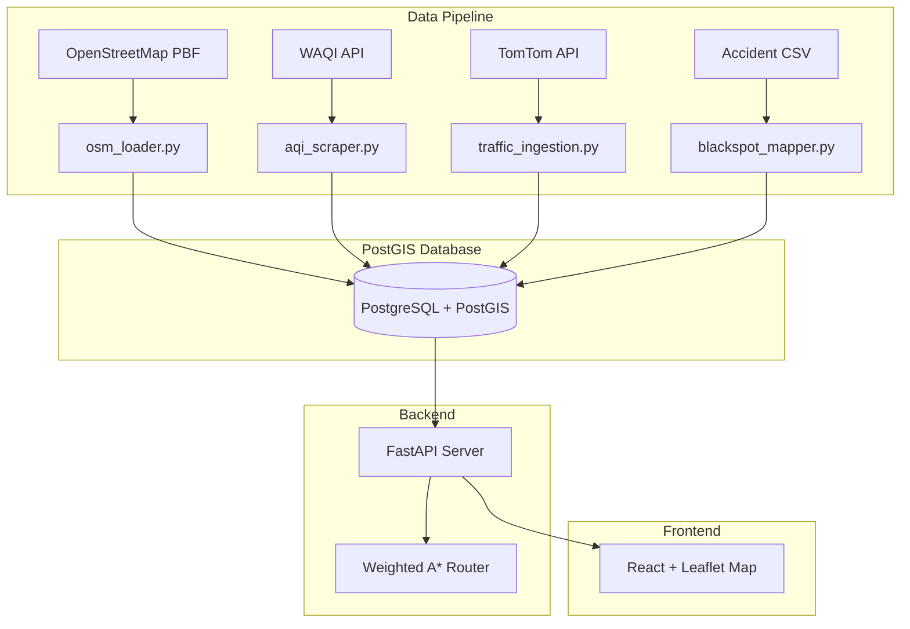

# 🗺️ SafeMAPS — Health Route Optimizer for Bangalore

A health-and-safety-aware routing engine for Bangalore that computes optimal routes by minimizing a composite cost function combining **travel time**, **air quality exposure**, and **accident risk**.

## Architecture



## Core Cost Function

$$C_e = \alpha \cdot T_e + \beta \cdot \left( \int_{0}^{T_e} AQI(t) \, dt \right) + \gamma \cdot R_e$$

| Symbol | Meaning |
|--------|---------|
| $C_e$ | Total cost of road segment *e* |
| $T_e$ | Expected travel time |
| $AQI(t)$ | Air quality index over traversal duration |
| $R_e$ | Historical accident risk probability |
| $\alpha, \beta, \gamma$ | User-defined weights |

## Quick Start

```bash
# 1. Clone and configure
cp .env.example .env
# Edit .env with your API keys

# 2. Start infrastructure
docker-compose -f infrastructure/docker-compose.yml up -d

# 3. Seed the database
psql -h localhost -U healthroute -d healthroute -f data_pipeline/database_seeder.sql

# 4. Run data pipelines
cd data_pipeline
python osm_loader.py
python blackspot_mapper.py
python aqi_scraper.py

# 5. Start backend
cd backend
pip install -r requirements.txt
uvicorn main:app --reload --port 8000

# 6. Start frontend
cd frontend_app
npm install && npm run dev
```

## Project Structure

```
safeMAPS/
├── data_pipeline/       # Data ingestion scripts
├── routing_engine/      # GraphHopper config (future)
├── backend/             # FastAPI server + A* router
├── frontend_app/        # React + Leaflet web app
├── infrastructure/      # Docker + PostGIS setup
└── README.md
```

## Tech Stack

| Layer | Technology |
|-------|-----------|
| Database | PostgreSQL 16 + PostGIS 3.4 |
| Backend | Python 3.11+, FastAPI, asyncpg |
| Routing | Custom weighted A* algorithm |
| Frontend | React + Vite, Leaflet/MapLibre GL |
| Data | OSM, WAQI, TomTom, CPCB |

## License

MIT
