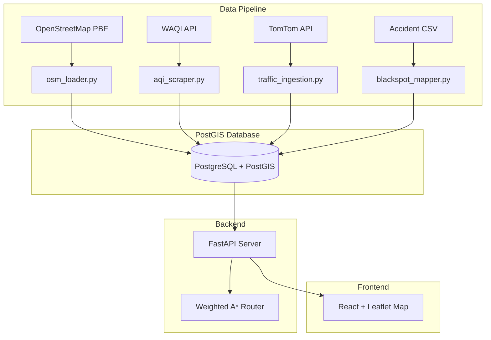

# 🗺️ SafeMAPS — Health Route Optimizer for Bangalore

A health-and-safety-aware routing engine for Bangalore that computes optimal routes by minimizing a composite cost function combining **travel time**, **air quality exposure**, and **accident risk**.

## Architecture


```mermaid
graph TB
    subgraph Data Pipeline
        OSM[OpenStreetMap PBF] --> Loader[osm_loader.py]
        WAQI[WAQI API] --> AQI[aqi_scraper.py]
        TomTom[TomTom API] --> Traffic[traffic_ingestion.py]
        CSV[Accident CSV] --> Blackspot[blackspot_mapper.py]
    end

    subgraph PostGIS Database
        Loader --> DB[(PostgreSQL + PostGIS)]
        AQI --> DB
        Traffic --> DB
        Blackspot --> DB
    end

    subgraph Backend
        DB --> FastAPI[FastAPI Server]
        FastAPI --> Router[Weighted A* Router]
    end

    subgraph Frontend
        FastAPI --> Map[React + Leaflet Map]
    end
```

## Core Cost Function

$$C_e = \alpha \cdot T_e + \beta \cdot \left( \int_{0}^{T_e} AQI(t) \, dt \right) + \gamma \cdot R_e$$

| Symbol | Meaning |
|--------|---------|
| $C_e$ | Total cost of road segment *e* |
| $T_e$ | Expected travel time |
| $AQI(t)$ | Air quality index over traversal duration |
| $R_e$ | Historical accident risk probability |
| $\alpha, \beta, \gamma$ | User-defined weights |

## Quick Start

```bash
# 1. Clone and configure
cp .env.example .env
# Edit .env with your API keys

# 2. Start infrastructure
docker-compose -f infrastructure/docker-compose.yml up -d

# 3. Seed the database
psql -h localhost -U healthroute -d healthroute -f data_pipeline/database_seeder.sql

# 4. Run data pipelines
cd data_pipeline
python osm_loader.py
python blackspot_mapper.py
python aqi_scraper.py

# 5. Start backend
cd backend
pip install -r requirements.txt
uvicorn main:app --reload --port 8000

# 6. Start frontend
cd frontend_app
npm install && npm run dev
```

## Project Structure

```
safeMAPS/
├── data_pipeline/           # Data ingestion scripts
├── routing_engine/          # GraphHopper config (future)
├── backend/
│   ├── main.py              # FastAPI server
│   ├── mcp_server.py        # MCP server (streamable-http, port 8001)
│   └── Dockerfile.mcp       # MCP-specific Docker image
├── frontend_app/            # React + Leaflet web app
├── infrastructure/
│   ├── docker-compose.yml
│   └── railway.toml         # Railway deploy config for MCP server
├── docs/
│   └── mcp_setup.md         # MCP setup guide (local + remote)
└── README.md
```

## Tech Stack

| Layer | Technology |
|-------|-----------|
| Database | PostgreSQL 16 + PostGIS 3.4 |
| Backend | Python 3.11+, FastAPI, asyncpg |
| Routing | Custom weighted A* algorithm |
| Frontend | React + Vite, Leaflet/MapLibre GL |
| Data | OSM, WAQI, TomTom, CPCB, BTP/OpenCity |
| MCP | `mcp>=1.2`, streamable-http transport |

## Connect to Claude (MCP)

SafeMAPS exposes its routing, AQI, and accident-risk logic as MCP tools,
so Claude can answer questions like *"what's the safest route from Koramangala
to Whitefield right now, and why is it slower?"* without anyone touching the UI.

**This server is read-only.** No tool mutates any state.

### Quick connect (deployed server)

Add this to your Claude Desktop config (`claude_desktop_config.json`):

```json
{
  "mcpServers": {
    "safemaps": {
      "url": "https://<railway-url>/mcp"
    }
  }
}
```

### Example prompts

```
Compare the fastest and safest route from MG Road to Electronic City right now.
```
```
What is the current AQI near Silk Board Junction, and what will it be in 30 minutes?
```
```
Are there any recorded accident blackspots within 500m of Hebbal flyover?
```

### Available tools (7)

| Tool | Description |
|---|---|
| `get_safe_route` | Route A→B with a named profile (fastest/safest/healthiest/balanced) |
| `compare_route_profiles` | All four profiles side-by-side with real trade-off numbers |
| `explain_route_cost` | Plain-language cost breakdown (time vs AQI vs accident risk) |
| `get_aqi_heatmap_summary` | AQI summary for a bounding box |
| `get_aqi_near` | Current AQI at a lat/lon |
| `get_accident_risk_near` | Accident blackspots near a point (real BTP data) |
| `predict_aqi_near` | **Forecasted** AQI near a lat/lon N minutes from now (LSTM) |

For local setup instructions, see [`docs/mcp_setup.md`](docs/mcp_setup.md).

## License

MIT
