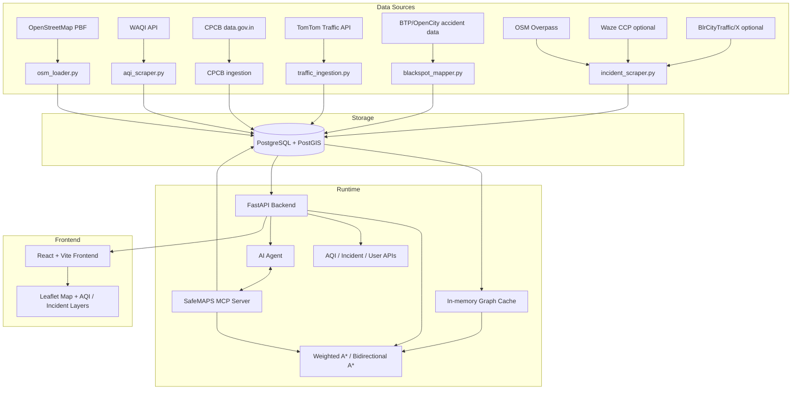
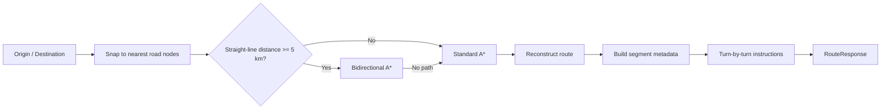
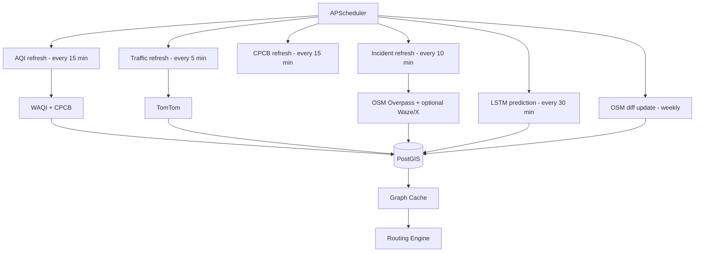
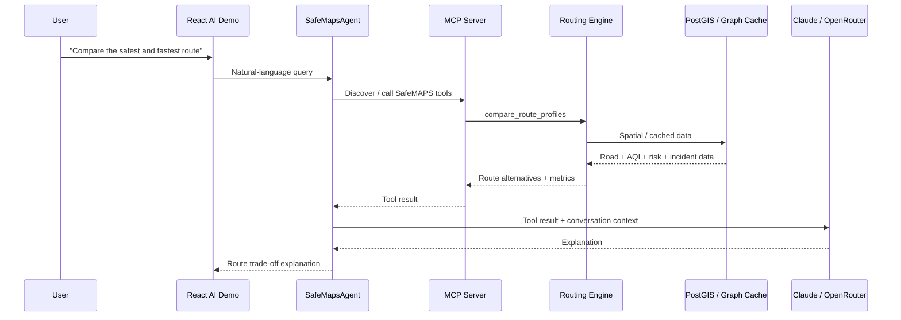

# 🗺️ SafeMAPS — Health & Safety-Aware Routing for Bengaluru


> **Summary:** SafeMAPS is a health-and-safety-aware routing platform for Bengaluru that goes beyond shortest-path navigation by combining **travel time, air-quality exposure, accident risk, live incidents, and time-of-day risk** into a custom routing engine. It uses a **custom weighted A\*** search (with bidirectional A\* for longer routes), **PostgreSQL/PostGIS**, an **LSTM model for AQI forecasting**, live data ingestion pipelines, and an **MCP-powered AI assistant** that can reason over the routing tools and explain route trade-offs in natural language.

> SafeMAPS is a Bengaluru-focused portfolio project. It is designed as a planning and decision-support system; modeled risk scores are not safety guarantees.

---

## 🌟 What SafeMAPS Solves

Conventional navigation systems are primarily optimized for travel time. SafeMAPS treats routing as a multi-objective problem: a route can be slightly slower but substantially healthier or lower-risk.

A user can choose among four routing profiles:

| Profile | Goal |
|---|---|
| **Fastest** | Minimize travel time |
| **Safest** | Prioritize accident risk while retaining some time/AQI weighting |
| **Healthiest** | Minimize air-quality exposure with a smaller risk component |
| **Balanced** | Trade off time, air quality, and accident risk |

Users can also work with custom weights through the routing API/UI, allowing the same engine to support different preferences.

---

## 🏗️ System Architecture

SafeMAPS is split into a data/graph layer, a FastAPI backend, a React frontend, and an MCP service that exposes the same routing and intelligence capabilities to an LLM.


```mermaid
graph TB
    subgraph Data Sources
        OSM[OpenStreetMap PBF] --> Loader[osm_loader.py]
        WAQI[WAQI API] --> AQI[aqi_scraper.py]
        CPCB[CPCB data.gov.in] --> CPCBIngest[CPCB ingestion]
        TomTom[TomTom Traffic API] --> Traffic[traffic_ingestion.py]
        BTP[BTP/OpenCity accident data] --> Blackspot[blackspot_mapper.py]
        OSMInc[OSM Overpass] --> Incidents[incident_scraper.py]
        Waze[Waze CCP optional] --> Incidents
        X[BlrCityTraffic/X optional] --> Incidents
    end

    subgraph Storage
        Loader --> DB[(PostgreSQL + PostGIS)]
        AQI --> DB
        CPCBIngest --> DB
        Traffic --> DB
        Blackspot --> DB
        Incidents --> DB
    end

    subgraph Runtime
        DB --> Cache[In-memory Graph Cache]
        Cache --> Router[Weighted A* / Bidirectional A*]
        DB --> FastAPI[FastAPI Backend]
        FastAPI --> Router
        FastAPI --> AQIAPI[AQI / Incident / User APIs]
        FastAPI --> AI[AI Agent]
        AI <--> MCP[SafeMAPS MCP Server]
        MCP --> Router
        MCP --> DB
    end

    subgraph Frontend
        FastAPI --> React[React + Vite Frontend]
        React --> Map[Leaflet Map + AQI / Incident Layers]
    end
```

### Core technologies

| Layer | Technology |
|---|---|
| Frontend | React 19, Vite, React Leaflet |
| Backend | Python 3.11+, FastAPI, asyncpg |
| Database | PostgreSQL 16, PostGIS 3.4 |
| Routing | Custom weighted A\*, bidirectional A\* for longer routes |
| ML | PyTorch LSTM for AQI forecasting |
| Data | OpenStreetMap, WAQI, CPCB, TomTom, BTP/OpenCity, Overpass, optional Waze/X |
| AI Tooling | Anthropic tool calling / OpenRouter + SafeMAPS MCP |
| Scheduling | APScheduler |
| Deployment | Docker / Docker Compose, Railway configuration |
| Spatial | PostGIS, Shapely, GeoJSON |

---

## 🧭 Routing Engine

SafeMAPS represents the road network as an in-memory graph after startup. Route requests only need two database lookups to snap the origin and destination to nearby road nodes; the subsequent node/edge, AQI, risk, incident, and geometry lookups come from the graph cache.

For routes shorter than 5 km, the engine uses standard A\*. For longer routes, it dispatches to **bidirectional A\*** to reduce the search space, while falling back to standard A\* if the bidirectional search does not return a path.


```mermaid
flowchart LR
    A[Origin / Destination] --> B[Snap to nearest road nodes]
    B --> C{Straight-line distance >= 5 km?}
    C -->|No| D[Standard A*]
    C -->|Yes| E[Bidirectional A*]
    E -->|No path| D
    D --> F[Reconstruct route]
    F --> G[Build segment metadata]
    G --> H[Turn-by-turn instructions]
    H --> I[RouteResponse]
```

### Composite edge cost

Each road segment is scored with a composite cost:

$$
C_e = \alpha T_e + \beta \left(\frac{AQI_e \cdot f_{road}}{500}\right)T_{min} + \gamma(R_e + I_e)
$$

Where:

| Component | Meaning |
|---|---|
| $T_e$ | Segment travel time |
| $AQI_e$ | AQI associated with the segment |
| $f_{road}$ | Road-class exposure factor |
| $R_e$ | Normalized accident-risk component |
| $I_e$ | Live incident cost |
| $\alpha, \beta, \gamma$ | User/profile weights |

The implementation also adds **road-class baselines** and **time-of-day multipliers**. This prevents two nearby roads sharing the same coarse AQI grid cell or accident radius from becoming indistinguishable.

### Default profile weights

```text
FASTEST     = (1.0, 0.0, 0.0)
SAFEST      = (0.1, 0.15, 0.75)
HEALTHIEST  = (0.0, 0.85, 0.15)
BALANCED    = (0.4, 0.3, 0.3)
```

### Time-of-day risk

The routing engine can adjust risk by departure hour. Examples implemented in the engine include increased weighting for school-zone periods and elevated night-time risk on trunk/motorway classes.

---

## 🌫️ AQI & Live-Data Pipeline

SafeMAPS does not treat the map as a static dataset. A background scheduler continuously refreshes the information that feeds the routing graph.


```mermaid
flowchart TD
    Scheduler[APScheduler]
    Scheduler --> AQIJob[AQI refresh - every 15 min]
    Scheduler --> TrafficJob[Traffic refresh - every 5 min]
    Scheduler --> LSTMJob[LSTM prediction - every 30 min]
    Scheduler --> CPCBJob[CPCB refresh - every 15 min]
    Scheduler --> IncidentJob[Incident refresh - every 10 min]
    Scheduler --> OSMJob[OSM diff update - weekly]

    AQIJob --> Sources1[WAQI + CPCB]
    TrafficJob --> Sources2[TomTom]
    IncidentJob --> Sources3[OSM Overpass + optional Waze/X]

    Sources1 --> DB[(PostGIS)]
    Sources2 --> DB
    Sources3 --> DB
    LSTMJob --> DB
    OSMJob --> DB

    DB --> Graph[Graph Cache]
    Graph --> Router[Routing Engine]
```

### AQI sources

| Source | Role | Frequency | Configuration |
|---|---|---:|---|
| WAQI | Station AQI | ~15 min | `WAQI_API_TOKEN` |
| CPCB / data.gov.in | Real-time station data | ~15 min | `CPCB_API_KEY` |
| AQI grid | Spatial interpolation / heatmap | Derived | Database-backed |

The CPCB ingestion path can be used as a more recent source where available, while WAQI fills gaps. Station records are spatially deduplicated within the configured radius.

### Traffic

Traffic ingestion uses the TomTom Traffic API when configured. Segment congestion is stored with the route graph and returned as part of segment metadata.

### Live incidents

SafeMAPS can ingest incident information from multiple sources:

- OpenStreetMap Overpass as the baseline source
- Waze CCP when approved/configured
- Optional BTP / `@BlrCityTraffic` extraction through X API

Incidents are spatially deduplicated; higher severity wins when nearby reports refer to the same event. Incident severity contributes an explicit cost to affected road edges.

---

## 🤖 AQI Forecasting with LSTM

SafeMAPS includes a lightweight PyTorch LSTM model that forecasts AQI for individual monitoring stations.

### Model design

The training pipeline uses a **48-reading history window** (48 × 15-minute readings = 12 hours) and predicts the AQI **30 minutes ahead**.

The model uses six engineered features:

1. Normalized AQI
2. Normalized PM2.5
3. Cyclic hour-of-day encoding (sin/cos)
4. Cyclic day-of-week encoding (sin/cos)

The compact network uses:

- 1-layer LSTM
- Hidden size: 64
- Dropout: 0.2
- Linear output layer
- Adam optimizer
- MSE loss
- Early stopping with patience 5

The API first checks the cached prediction table. If a fresh prediction is unavailable and a trained model exists, it can run inference inline.

---

## 🧠 AI Assistant + MCP

SafeMAPS exposes its routing and environmental intelligence through a **Model Context Protocol (MCP)** server. The AI layer can discover and call these tools instead of inventing route information itself.


```mermaid
sequenceDiagram
    participant User
    participant UI as React AI Demo
    participant Agent as SafeMapsAgent
    participant MCP as MCP Server
    participant Router as Routing Engine
    participant DB as PostGIS / Graph Cache
    participant LLM as Claude / OpenRouter

    User->>UI: "Compare the safest and fastest route"
    UI->>Agent: Natural-language query
    Agent->>MCP: Discover / call SafeMAPS tools
    MCP->>Router: compare_route_profiles
    Router->>DB: Spatial / cached data
    DB-->>Router: Road + AQI + risk + incident data
    Router-->>MCP: Route alternatives + metrics
    MCP-->>Agent: Tool result
    Agent->>LLM: Tool result + conversation context
    LLM-->>Agent: Explanation
    Agent-->>UI: Route trade-off explanation
```

### MCP tools

The current MCP server exposes seven read-only tools:

| Tool | Purpose |
|---|---|
| `get_safe_route` | Compute a route with a named profile |
| `compare_route_profiles` | Run fastest, safest, healthiest, and balanced routes together |
| `explain_route_cost` | Explain the contribution of time, AQI, and accident risk |
| `get_aqi_heatmap_summary` | Summarize AQI across a bounding box |
| `get_aqi_near` | Return the best AQI estimate near a point |
| `get_accident_risk_near` | Find nearby recorded accident-risk blackspots |
| `predict_aqi_near` | Return a future AQI estimate using the LSTM pipeline |

The MCP transport is **streamable HTTP**, exposed at `/mcp`. The server is read-only and can be used by Claude Desktop, claude.ai, or another MCP client.

---

## 💬 Natural-Language Routing Examples

The AI layer is designed for questions such as:

```text
Compare the fastest and safest route from MG Road to Electronic City right now.
```

```text
What is the current AQI near Silk Board Junction, and what will it be in 30 minutes?
```

```text
Are there any recorded accident blackspots within 500m of Hebbal flyover?
```

```text
Explain why the healthiest route from Koramangala to Whitefield costs more than the fastest one.
```

The agent has lightweight Bangalore locality resolution for common places such as Koramangala, Whitefield, Indiranagar, MG Road, Silk Board, Hebbal, Electronic City, Yelahanka, Kengeri, Bommasandra, and the airport area.

---

## 🗺️ Frontend

The frontend is a React + Vite application with a Leaflet-based map and multiple views for route planning and environmental data.

### Main UI capabilities

- Route planning with named profiles
- Fastest / safest / healthiest / balanced comparisons
- AQI heatmap visualization
- Accident blackspot visualization
- Live incident layer
- Green Score and saved commute views
- AI route-planning demo
- Route analysis and tool-call presentation
- Browser-based navigation support using live position tracking
- Shareable route URLs
- PWA support

The application also has an explicit **offline/demo mode** so the frontend can detect when the backend is unavailable.

---

## 📡 API Surface

The FastAPI backend exposes routing, environmental, user, AI, and admin APIs.

### Routing

```text
POST /api/route
GET  /api/route/compare
```

`/api/route` accepts origin/destination coordinates, a route profile, optional custom weights, and an optional departure time.

### Air quality

```text
GET /api/aqi/heatmap
GET /api/aqi/predict
GET /api/aqi/history
GET /api/aqi/stations
```

### Safety / incidents

```text
GET /api/safety/blackspots
GET /api/incidents/active
```

### AI

```text
GET  /api/ai/status
POST /api/ai/chat
POST /api/ai/reset
POST /api/ai/profile-routes
```

### User / green score

```text
POST /api/user/trips
GET  /api/user/trips
GET  /api/user/green-score
```

### System / administration

```text
GET  /health
GET  /metrics
POST /api/admin/refresh-graph
POST /api/admin/refresh-aqi
POST /api/admin/run-aqi-scrape
POST /api/admin/run-traffic-scrape
POST /api/admin/expire-incidents
```

Administrative endpoints are protected by `ADMIN_API_KEY`.

---

## 🚀 Getting Started

### Prerequisites

- Docker + Docker Compose
- Python 3.11+
- Node.js 18+
- PostgreSQL / PostGIS for local database work
- Optional API keys for live providers
- Ollama is optional for some local AI workflows

### 1. Clone and configure

```bash
git clone <repo-url>
cd safeMAPS
cp .env.example .env
```

Configure the required database settings and any providers you want to enable.

### 2. Start infrastructure

```bash
docker-compose -f infrastructure/docker-compose.yml up -d
```

The stack includes:

- PostgreSQL + PostGIS
- PgBouncer transaction-mode connection pooling
- FastAPI backend
- MCP server
- React frontend

The frontend is exposed on port `3000`; the backend uses port `8000`; the MCP service uses port `8001` inside the Docker network.

### 3. Seed the database

```bash
psql -h localhost -U healthroute -d healthroute \
  -f data_pipeline/database_seeder.sql
```

### 4. Run the data loaders

```bash
cd data_pipeline
python osm_loader.py
python blackspot_mapper.py
python aqi_scraper.py
```

Additional ingestion and migration scripts are available for traffic, incidents, CPCB, and OSM updates.

### 5. Run the backend manually

```bash
cd backend
pip install -r requirements.txt
uvicorn main:app --reload --port 8000
```

### 6. Run the frontend manually

```bash
cd frontend_app
npm install
npm run dev
```

The Vite development server runs on the standard Vite development port unless configured otherwise.

---

## ⚙️ Environment Variables

### Database

```env
POSTGRES_HOST=localhost
POSTGRES_PORT=5432
POSTGRES_DB=healthroute
POSTGRES_USER=healthroute
POSTGRES_PASSWORD=...
```

### Live data

```env
WAQI_API_TOKEN=...
TOMTOM_API_KEY=...
CPCB_API_KEY=...
WAZE_CCP_URL=...
X_BEARER_TOKEN=...
```

### Admin / AI

```env
ADMIN_API_KEY=...
LLM_PROVIDER=anthropic
ANTHROPIC_API_KEY=...
ANTHROPIC_MODEL=...
OPENROUTER_API_KEY=...
OPENROUTER_MODEL=...
MCP_SERVER_URL=http://localhost:8001/mcp
```

The AI provider configuration supports either a direct Anthropic path or an OpenRouter-compatible path. When a server-side LLM key is absent, the application can fall back to deterministic local tool execution instead of failing outright.

### Bengaluru map bounds

The project uses configurable latitude/longitude bounds through:

```env
BBOX_MIN_LAT=12.85
BBOX_MAX_LAT=13.15
BBOX_MIN_LON=77.45
BBOX_MAX_LON=77.78
```

The Docker Compose configuration uses an expanded Bengaluru bounding box for the full stack.

---

## 📁 Project Structure

```text
safeMAPS/
├── backend/
│   ├── ai/
│   │   ├── agent.py              # LLM/tool orchestration
│   │   ├── mcp_client.py         # MCP client integration
│   │   ├── prompts.py            # AI system prompts
│   │   └── session.py            # Conversation/session state
│   ├── routes/
│   │   ├── route.py              # Route + route comparison APIs
│   │   ├── aqi.py                # AQI heatmap, forecast, station APIs
│   │   ├── safety.py             # Blackspot APIs
│   │   ├── incidents.py          # Live incident APIs
│   │   ├── user.py               # Trips + green score
│   │   └── ai.py                 # AI endpoints
│   ├── routing.py                # Weighted A* routing engine
│   ├── bidirectional_astar.py    # Long-route bidirectional search
│   ├── graph_cache.py            # In-memory graph + dynamic edge data
│   ├── spatial_queries.py        # PostGIS spatial helpers
│   ├── mcp_server.py             # Streamable HTTP MCP server
│   ├── scheduler.py              # Background refresh jobs
│   ├── database.py               # asyncpg connection pool
│   ├── models.py                 # Pydantic request/response models
│   └── main.py                   # FastAPI entry point
│
├── data_pipeline/
│   ├── osm_loader.py             # OSM road graph ingestion
│   ├── traffic_ingestion.py      # TomTom traffic ingestion
│   ├── aqi_scraper.py            # AQI ingestion
│   ├── cpcb_scraper.py            # CPCB ingestion
│   ├── incident_scraper.py       # Live incident ingestion
│   ├── blackspot_mapper.py       # Accident blackspot preparation
│   ├── btp_accident_importer.py  # Historical BTP/OpenCity data import
│   ├── lstm_trainer.py           # AQI model training/inference
│   ├── osm_diff_updater.py       # Incremental OSM refresh
│   └── database_seeder.sql       # Initial schema/data setup
│
├── frontend_app/
│   └── src/
│       ├── components/           # Map, heatmap, green score, UI
│       ├── components/ai/         # AI map, route analysis, tool cards
│       ├── pages/                # AI demo and application views
│       ├── services/             # API clients
│       └── utils/                # Share URLs, saved commutes, AQI trend
│
├── infrastructure/
│   ├── docker-compose.yml
│   ├── init-postgis.sh
│   ├── nginx.conf
│   └── pgbouncer_config.py
│
├── docs/
│   ├── PIPELINE.md               # Data pipeline architecture
│   ├── MCP_SERVER.md             # Historical MCP notes
│   ├── mcp_setup.md              # Current MCP setup
│   └── RTI_BTP_accident_data.md  # Historical accident data request notes
│
├── routing_engine/
│   └── custom_weighting.java
│
└── README.md
```

---

## 🔬 Engineering Decisions

### Why a custom A\* implementation?

The project needs route costs that are not represented by distance alone. Each edge can incorporate travel time, AQI exposure, accident risk, incident severity, road class, and departure-time effects. Keeping the search engine inside the application makes those signals available directly during path expansion.

### Why keep the graph in memory?

The road network is relatively static compared with live AQI, traffic, and incident values. SafeMAPS therefore loads the graph once and maintains dynamic edge attributes in the cache. This avoids repeatedly querying PostGIS for every neighbor expansion during A\*.

### Why bidirectional A\* for longer routes?

Long searches can explore large portions of the road graph. The routing layer dispatches routes with at least 5 km of straight-line separation to a bidirectional search, with a standard-A\* fallback for robustness.

### Why road-class exposure/risk factors?

AQI and blackspot information are spatially coarse. Two roads that are physically close can receive the same environmental or risk signal. Road-class factors add another differentiating signal so health-oriented and safety-oriented profiles do not collapse onto identical routes simply because of spatial granularity.

### Why an MCP layer?

The AI assistant should reason using the application's actual routing logic instead of receiving raw database access or generating unsupported route claims. MCP provides a clean tool boundary: the LLM can request a route, compare profiles, inspect AQI, or explain cost, while SafeMAPS remains responsible for the computation.

### Why PgBouncer?

The API can execute multiple route searches concurrently, particularly when comparing all four profiles. PgBouncer is included in the Docker stack to use transaction-mode pooling and reduce connection pressure on PostgreSQL.

---

## 📊 Scheduler Cadence

The backend scheduler currently defines these background jobs:

| Job | Cadence |
|---|---:|
| WAQI / AQI refresh | 15 min |
| TomTom traffic refresh | 5 min |
| LSTM AQI prediction | 30 min |
| CPCB refresh | 15 min |
| Incident refresh | 10 min |
| OSM diff refresh | Weekly |

The graph cache is refreshed when the underlying road/environmental data changes, while the road topology itself is treated as comparatively stable.

---

## 🧪 API / Runtime Verification

The backend exposes a health endpoint:

```bash
curl http://localhost:8000/health
```

The MCP service exposes:

```text
GET /health
GET /mcp
```

For administration and recovery, protected endpoints can refresh the graph and individual data layers once `ADMIN_API_KEY` is configured.

---

## ⚠️ Current Scope & Limitations

- SafeMAPS is **Bengaluru-specific**: road, AQI, and accident datasets are configured around Bengaluru.
- Risk scores are **modeled planning signals**, not guarantees of safety.
- Some live data providers are optional and require third-party API access.
- The MCP deployment is intended for portfolio/demo use; the project documentation notes that a public deployment does not currently add authentication or rate limiting.
- A cold start may take longer because the routing graph is loaded into memory before the backend can serve route requests normally.
- The full road graph and environmental layers require non-trivial memory/storage, especially when the expanded Bengaluru bounds are used.

---

## 📚 Additional Documentation

More implementation detail is available in the repository:

- [`docs/PIPELINE.md`](docs/PIPELINE.md) — detailed data pipeline and scheduler architecture
- [`docs/mcp_setup.md`](docs/mcp_setup.md) — current MCP deployment and Claude integration instructions
- [`docs/RTI_BTP_accident_data.md`](docs/RTI_BTP_accident_data.md) — historical accident-data request notes

---

## 📜 License

MIT
